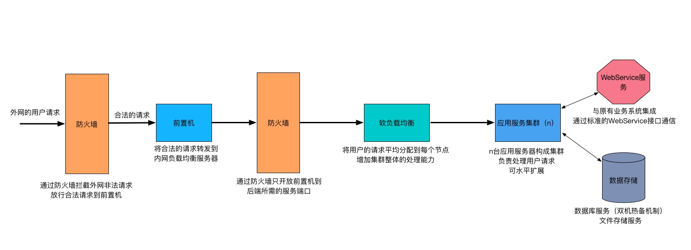
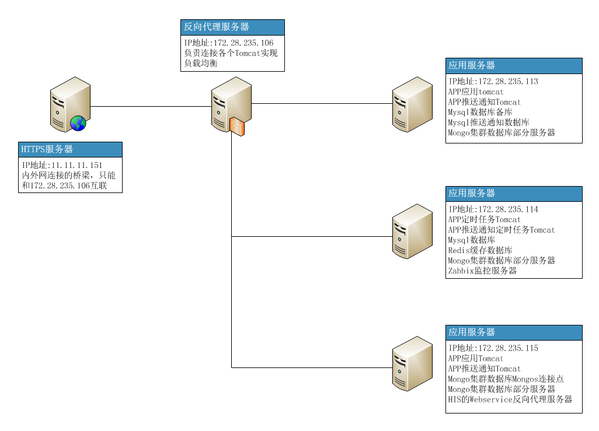
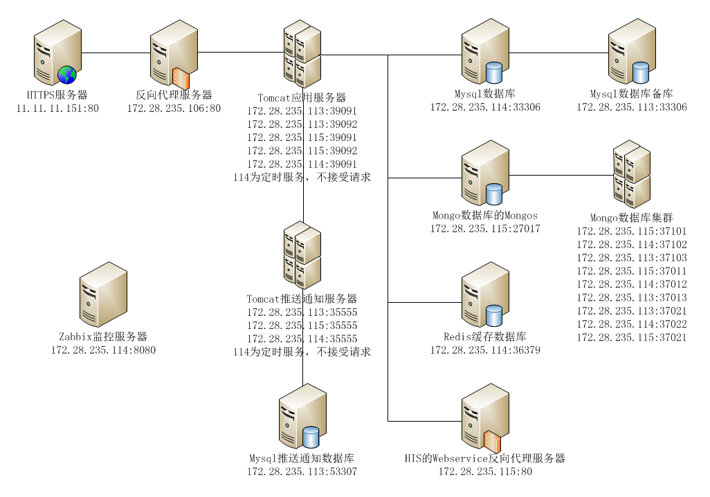

# 掌上盛京服务器部署情况 #

## 部署结构

## 服务器一览 ##

### 服务器：11.11.11.151 ###
- 正式服务器。内外网连接的桥梁，只能和172.28.235.106互联
- 用户：root 密码：oaABC123!
- 域名：sjh.sj-hospital.org
- https反向代理服务器（容器：https_isj-nginx_1）

### 服务器：172.28.235.106 ###
- 正式服务器
- 用户：root 密码：oaABC123!
- 掌上盛京 [反向代理](./服务器106/opt/docker/isj_official/nginx/nginx.conf) 服务器（容器：isjofficial_isj-nginx_official_1）
- [APP 热部署服务](./服务器106/opt/docker/isj_official/nginx/hc)
- 掌上盛京后台管理端，执行 [./opt/docker/isj_official/nginx/isjadm/update.sh](./服务器106/opt/docker/isj_official/nginx/isjadm/update.sh) 更新（需 github 访问权限）
- 掌上盛京kettle统计定时任务，自动统计掌上盛京业务数据
- 掌上盛京反向代理nginx定时任务，日志按天分割，及日志保留天数策略

### 服务器：172.28.235.107 ###
- 测试服务器
- 用户：root 密码：oaABC123!

### 服务器：172.28.235.108 ###
- 测试服务器
- 用户：root 密码：oaABC123!

### 服务器：172.28.235.109 ###
- 测试服务器
- 用户：root 密码：oaABC123!

### 服务器：172.28.235.113 ###
- 正式服务器
- 用户：root 密码：oaABC123!
- 掌上盛京tomcat服务器（容器：isjofficial_isj-pep1_official_1、isjofficial_isj-pep2_official_1）
- 掌上盛京推送通知tomcat服务器（容器：isjofficial_isj-properpush_official_1）
- 掌上盛京mysql备份服务器（容器：isjofficial_isj-mysql_slave_official_1）
- 掌上盛京推送通知mysql服务器（容器：isjofficial_isj-mysql_push_official_1）
- 掌上盛京mongo集群部分服务器（容器：isjofficial_isj-mongo_official_cf3_1、isjofficial_isj-mongo_official_rs1_3_1、isjofficial_isj-mongo_official_rs2_1_1）

### 服务器：172.28.235.114 ###
- 正式服务器
- 用户：root 密码：oaABC123!
- 掌上盛京tomcat服务器，只处理定时任务，不接收请求（容器：isjofficial_isj-pep1_official_1）
- 掌上盛京推送通知tomcat服务器，只处理定时任务，不接收请求（容器：isjofficial_isj-properpush_official_1）
- 掌上盛京mysql主服务器（容器：isjofficial_isj-mysql_official_1）
- 掌上盛京redis缓存服务器（容器：isjofficial_isj-redis_official_1）
- 掌上盛京mongo集群部分服务器（容器：isjofficial_isj-mongo_official_cf2_1、isjofficial_isj-mongo_official_rs1_2_1、isjofficial_isj-mongo_official_rs2_2_1）
- 长期保存查看日志的mongo服务器（容器：isjofficial_isj-mongo_log_1）
- zabbix服务器，对各服务器及应用监控（容器：zabbix_zabbix-mysql_1、zabbix_zabbix-server_1、zabbix_zabbix-web_1）
- 掌上盛京mysql每天备份定时任务
- 掌上盛京请求his日志每天备份定时任务，并把每天备份的日志复制到长期保存日志的mongo中

### 服务器：172.28.235.115 ###
- 正式服务器
- 用户：root 密码：oaABC123!
- 掌上盛京tomcat服务器（容器：isjofficial_isj-pep1_official_1、isjofficial_isj-pep2_official_1）
- 掌上盛京推送通知tomcat服务器（容器：isjofficial_isj-properpush_official_1）
- HIS 的 Web Service [反向代理](./服务器115/opt/docker/isj_official/nginx/nginx.conf) 服务器（容器：isjofficial_isj-nginx_official_1）
- 掌上盛京mongos服务器，及集群部分服务器（容器：mongos_isj-mongo_official_router_1、isjofficial_isj-mongo_official_cf1_1、isjofficial_isj-mongo_official_rs1_1_1、isjofficial_isj-mongo_official_rs2_3_1）
- HIS 的 Web Service反向代理nginx定时任务，日志按天分割，及日志保留天数策略

## 各类应用详细 ##

### docker ###
- 各服务器都采用docker容器部署应用
- 各服务器docker都安装在 /opt/docker/docker/ 内
- 正式服务器的容器设置都保存在 /opt/docker/isj_official/docker-compose.yml 内

### nginx ###

#### https反向代理服务器 ####
- https反向代理服务器
- ip地址：11.11.11.151:80
- 容器名称：https_isj-nginx_1
- 配置和日志保存位置：/opt/https

#### 掌上盛京的nginx反向代理 ####
- 反向代理掌上盛京，及推送通知tomcat服务器
- ip地址：172.28.235.106:80
- 容器名称：isjofficial_isj-nginx_official_1
- 配置和日志保存位置：/opt/docker/isj_official/nginx/

#### his的webservice的nginx反向代理 ####
- 反向代理his的webservice服务器
- ip地址：172.28.235.115:80
- 容器名称：isjofficial_isj-nginx_official_1
- 配置和日志保存位置：/opt/docker/isj_official/nginx/

### tomcat ###

#### 掌上盛京tomcat ####
- 部署掌上盛京web工程，共5个tomcat，分布在服务器113、114、115上，其中172.28.235.114:39091只处理定时任务，不接收请求
- ip地址：172.28.235.113:39091、172.28.235.113:39092、172.28.235.114:39091、172.28.235.115:39091、172.28.235.115:39092
- 容器名称：各服务器的isjofficial_isj-pep1_official_1、isjofficial_isj-pep2_official_1
- web工程和日志保存位置：各服务器的/opt/docker/isj_official/pep1/、/opt/docker/isj_official/pep2/

#### 掌上盛京推送通知tomcat ####
- 部署掌上盛京推送通知web工程，共3个tomcat，分布在服务器113、114、115上，其中172.28.235.114:35555只处理定时任务，不接收请求
- ip地址：172.28.235.113:35555、172.28.235.114:35555、172.28.235.115:35555
- 容器名称：各服务器的isjofficial_isj-properpush_official_1
- web工程和日志保存位置：各服务器的/opt/docker/isj_official/properpush/

### mysql ###

#### 掌上盛京mysql ####
- 保存掌上盛京业务的关系型数据，配置了两个mysql进行主从复制备份
- 用户：root 密码：123456
- 用户：isj 密码：isj
- ip地址：172.28.235.114:33306（主）、172.28.235.113:33306（从）
- 容器名称：isjofficial_isj-mysql_official_1、isjofficial_isj-mysql_slave_official_1
- 数据及配置保存位置：/opt/docker/isj_official/mysql/、/opt/docker/isj_official/mysql_slave/

#### 掌上盛京推送通知mysql ####
- 保存掌上盛京的推送通知
- 用户：root 密码：123456
- 用户：properpush 密码：123456
- ip地址：172.28.235.113:53307
- 容器名称：isjofficial_isj-mysql_push_official_1
- 数据及配置保存位置：/opt/docker/isj_official/mysql_push/

### redis ###

#### 掌上盛京redis ####
- 保存掌上盛京缓存数据
- 密码：123456
- ip地址：172.28.235.114:36379
- 容器名称：isjofficial_isj-redis_official_1
- 数据及配置保存位置：/opt/docker/isj_official/redis

### mongo ###

#### 掌上盛京mongo ####
- 保存掌上盛京非关系型数据。采用集群配置，包括1个mongos，3个集群配置副本，2个分片，每个分片包含3个副本，其中分片的第3个副本为延时24复制副本
- 用户库：admin 用户：admin 密码：123456
- 用户库：admin 用户：isj 密码：isj
- ip地址：172.28.235.115:27017（mongos）、172.28.235.115:37101（配置服务器第1个副本）、172.28.235.114:37102（配置服务器第2个副本）、172.28.235.113:37103（配置服务器第3个副本）、172.28.235.115:37011（第1个分片第1个副本）、172.28.235.114:37012（第1个分片第2个副本）、172.28.235.113:37013（第1个分片第3个副本）、172.28.235.113:37021（第2个分片第1个副本）、172.28.235.114:37022（第2个分片第2个副本）、172.28.235.115:37021（第2个分片第3个副本）
- 容器名称：mongos_isj-mongo_official_router_1、isjofficial_isj-mongo_official_cf1_1、isjofficial_isj-mongo_official_cf2_1、isjofficial_isj-mongo_official_cf3_1、isjofficial_isj-mongo_official_rs1_1_1、isjofficial_isj-mongo_official_rs1_2_1、isjofficial_isj-mongo_official_rs1_3_1、isjofficial_isj-mongo_official_rs2_1_1、isjofficial_isj-mongo_official_rs2_2_1、isjofficial_isj-mongo_official_rs2_3_1
- 数据及配置保存位置：/opt/docker/isj_official/mongo_*

#### 掌上盛京长期保存log的mongo ####
- 为减轻保存业务数据mongo的存储压力，保存业务数据mongo只保存固定大小的全部log，保存不下的筛选掉不重要的数据后保存在该mongo中
- 用户库：admin 用户：admin 密码：123456
- 用户库：admin 用户：isj 密码：isj
- ip地址：172.28.235.114:27017
- 容器名称：isjofficial_isj-mongo_log_1
- 数据及配置保存位置：/opt/docker/isj_official/mongo_log/

### zabbix ###
- 对服务器和应用进行监控

#### zabbix的mysql ####
- 保存zabbix产生的监控数据
- 用户：root 密码：Proper123
- 用户：zabbix 密码：zabbix
- ip地址：172.28.235.114:3307
- 容器名称：zabbix_zabbix-mysql_1
- 数据及配置保存位置：/opt/docker/zabbix/mysql/

#### zabbix的service ####
- zabbix的服务器
- ip地址：172.28.235.114:10051
- 容器名称：zabbix_zabbix-mysql_1

#### zabbix的web ####
- zabbix的web页面服务器
- 用户：admin 密码：zabbix
- ip地址：172.28.235.114:8080
- 容器名称：zabbix_zabbix-web_1

#### zabbix的client ####
- 使用deb安装包，安装在每个被监控的服务器上，定时和service之间传送监控数据。client的端口号为10050
- 自定义监控数据的key保存在 /etc/zabbix/zabbix_agentd.conf.d/userParameter.conf 内
- 监控脚本保存在 /opt/zabbix/ 内

### 定时任务 ###
- 查看定时任务命令：crontab -e

#### nginx日志定时处理 ####
- 对nginx日志进行分割，删除超期的日志
- 定时任务服务器：172.28.235.106、172.28.235.115
- 定时脚本位置：/opt/backup/nginx/

#### kettle统计定时任务 ####
- 使用kettle每天对掌上盛京业务数据进行统计
- 定时任务服务器：172.28.235.106
- 定时脚本位置：/opt/kettle/

#### mysql定时备份 ####
- 每天对mysql进行导出备份
- 定时任务服务器：172.28.235.114
- 定时脚本位置：/opt/backup/mysql/

#### his日志定时备份 ####
- 每天对mysql进行导出备份
- 定时任务服务器：172.28.235.114
- 定时脚本位置：/opt/backup/mongo/

### ntp ###
- 所有服务器同172.28.235.108进行时间同步
- ntp各服务器配置文件位置：/etc/ntp.conf
